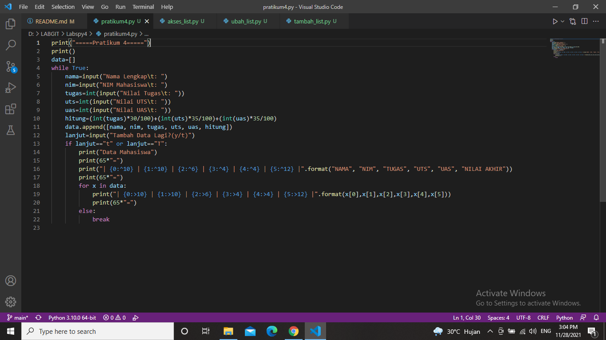

# Labspy4
## Tugas Pratikum 4
## 1. Tugas : Menambahkan Data ke Dalam List

<li> Flowchart </li>


<li> Program </li>



<li> Penjelasan </li>
1. Mendeklarasikan list data[] yang didalamnya berisi inputan (Nama,Nim,Tugas,Uts,Uas,Nilai Akhir). <p>

```bash
data=[]
```

2. Gunakan perulangan while loop dengan nilai "True". <p>

```bash
while True:
```

3. Menginput Nama, Nim, Tugas, Uts dan Uas. <p>

```bash
nama=input("Nama Lengkap\t: ")
nim=input("NIM Mahasiswa\t: ")
tugas=int(input("Nilai Tugas\t: "))
uts=int(input("Nilai UTS\t: "))
uas=int(input("Nilai UAS\t: "))
hitung=(int(tugas)*30/100)+(int(uts)*35/100)+(int(uas)*35/100)
```

4. Untuk variable data, inputan akan ditambahkan ke dalam list dengan method .append . <p>

```bash
data.append([nama, nim, tugas, uts, uas, hitung])
```

5. Pada input (Tambah Data Lagi?) apabila jawaban “t” atau “T”, maka program akan berhenti dan akan menampilkan hasil daftar datanya. <p>

```bash
lanjut=input("Tambah Data Lagi?(y/t)")
if lanjut=="t" or lanjut=="T":
```

6. Menampilkan hasil data yang telah diinput. <p>

```bash
print("Data Mahasiswa")
    	print(65*"=")
    	print("| {0:^10} | {1:^10} | {2:^6} | {3:^4} | {4:^4} | {5:^12} |".format("NAMA", "NIM", "TUGAS", "UTS", "UAS", "NILAI AKHIR"))
    	print(65*"=")
        for x in data:
        		print("| {0:>10} | {1:>10} | {2:>6} | {3:>4} | {4:>4} | {5:>12} |".format(x[0],x[1],x[2],x[3],x[4],x[5]))
        		print(65*"=")
    	else:
        		break
```

7. Gunakan print(65*"=") untuk membuat header dan footer agar terlihat lebih rapih, fungsi 65*”=” adalah untuk membuat “=” sebanyak 65 buah sebagai garis. <p>

```bash
print(65*"=")
```

8. Membuat isi tabel sesuai keinginan dengan format string. <p>

```bash
print("| {0:^10} | {1:^10} | {2:^6} | {3:^4} | {4:^4} | {5:^12} |".format("NAMA", "NIM", "TUGAS", "UTS", "UAS", "NILAI AKHIR"))
```

```bash
print("| {0:>10} | {1:>10} | {2:>6} | {3:>4} | {4:>4} | {5:>12} |".format(x[0],x[1],x[2],x[3],x[4],x[5]))
```

<li> Output </li>


## 2. Latihan : (Akses/Ubah/Tambah) List
Dalam bahasa pemrograman Python, struktur data yang paling dasar adalah urutan atau list. Setiap elemen-elemen berurutan akan diberi nomor posisi atau index nya. Index pertama dalam list adalah nol, index kedua adalah satu dan seterusnya. <p>

## Mengakses List

<li> Program </li>


<li> Penjelasan </li>
1. Membuat list dengan value (nilai) yang diinginkan. Dalam variable warna tersimpan nilai berupa array list yang didalamnya terdapat 6 elemen. Dimulai dari elemen pertama atau indeks ke-0 yaitu “black” dan diakhiri dengan elemen ke-6 atau indeks ke-5 yaitu “green”. <p>

```bash
warna=['black', 'white', 'grey', 'red', 'blue', 'green']
```

2. Menampilkan semua elemen yang terdapat pada list yang telah dibuat. <p>

```bash
print("List:", warna)
```

3. Untuk menampilkan elemen ketiga pada sebuah list, gunakan warna[3]. "warna" adalah nama variable dari list yang akan dibuat, sedangkan [3] adalah elemen ketiga karena kita akan menampilkan elemen yang ketiga. Note : Nomor indeks list selalu dimulai dari nol. <p>

```bash
print("Elemen ke-3 :", warna[3])
```

4. Jika ingin mengambil elemen kedua sampai keempat, gunakan warna[2:4]. <p>

```bash
print("Elemen ke-2 sampai elemen ke-4 :", warna[2:4])
```

5. Dan jika ingin mengambil elemen terakhir, maka gunakan warna[-1]. <p>

```bash
print("Elemen Terakhir :", warna[-1])
```

<li> Output </li>


## Mengubah List

<li> Program </li>


<li> Penjelasan </li>
1. Membuat list dengan nilai yang diinginkan. <p>

```bash
warna=['black', 'white', 'grey', 'red', 'blue', 'green']
print("List:", warna)
```

2. Untuk mengubah elemen ke-4 dengan nilai yang lain, gunakan warna[4]='galaxy'. <p>

```bash
print("List Sebelum Di Ubah :", warna)
```

```bash
warna[4]='galaxy'
print("List sesudah di ubah :", warna)
```

3. Jika ingin mengubah elemen ke-4 sampai dengan elemen terakhir, gunakan warna[4:]=["silver" , "gold"]. <p>

```bash
warna[4:]=["silver" , "gold"]
print("Ubah element ke-4 hingga akhir :", warna)
```

<li> Output </li>


## Menambah List

<li> Program </li>


<li> Penjelasan </li>
1. Buat list dengan variable X dan Y dengan nilai yang diinginkan. <p>

```bash
x=['A', 'B', 'C', 'D']
y=['E', 'F', 'G', 'H']
print("List X :", x, "\nList Y :", y)
```

2. Untuk mengambil 2 bagian dari list X dan tambahkan di list Y, gunakan y.append(x[0:2]). <p>

```bash
y.append(x[0:2])
print(y)
```

3. Menambahkan list Y dengan nilai string. <p>

```bash
y.append('I')
print(y)
```

4. Menambahkan 3 nilai ke dalam list Y. <p>

```bash
print(y+['J', 'K', 'L'])
print()
```

5. Untuk menggabungkan list Y dan list X, gunakan operator “+”. <p>

```bash
print(x+y)
```

<li> Output </li>


## Sekian Terima Kasih